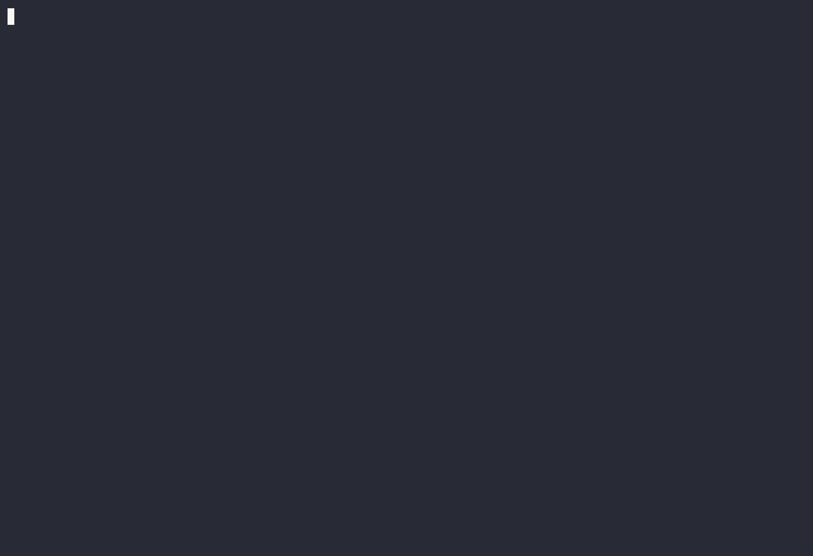

# nuclis

A local inference engine for GGUF language models, written in Zig with a
Metal backend for Apple Silicon, and a small coding agent on top of it.
Every layer is checked against a pinned llama.cpp build before it is made
fast.



*`nuclis agent` with Qwen3.8-27B on an M4 Pro, fixing a broken function
in a small Python project. Played back at 2× with pauses shortened; the
real session took 2 min 35 s. Recorded by `scripts/agent-demo.py`.*

## Status

An experimental project, built in my free time to learn how an inference
stack works, from the GGUF bytes to the sampled token, and to learn Zig.
It has run on one machine, the version is 0.x, and breaking changes arrive
without notice. The documents record what was measured, not what was
intended. Read it as a worked notebook with a working engine inside.

## Quick start

Requires macOS on Apple Silicon, Zig 0.16.0, and the Command Line Tools.

```sh
make metal                                      # release build, Metal backend
./zig-out/bin/nuclis model pull qwen3.8-27b --all   # pinned commit, SHA-256 verified
./zig-out/bin/nuclis config init --discover     # ~/.nuclis/nuclis.json, every model found
./zig-out/bin/nuclis agent                      # the chat, with tools, in this directory
```

`nuclis generate`, `bench`, `eval`, and `tokenize` cover the rest;
`nuclis --help` lists every command and `make help` the development targets.

## Models

The catalogue pins each model's repository, commit, and SHA-256, so
`nuclis model pull <name>` fetches exactly the bytes that were measured.
Every entry reads images and carries a draft head for speculative decoding.

| Family | Name | What is distinctive | Size |
| --- | --- | --- | ---: |
| Qwen3.8 | `qwen3.8-27b` | hybrid attention: 16 attention and 48 DeltaNet layers | 16.5 GB |
| Gemma 4 | `gemma-4-12b-qat` | dense, quantization-aware trained: every matrix Q4_0 | 6.7 GB |
| | `gemma-4-26b-a4b` | mixture of experts, 8 of 128 per token | 14.2 GB |
| | `gemma-4-e4b-qat` | on-device size: per-layer embeddings, shared KV layers | 4.2 GB |
| Muse Glimmer | `muse-glimmer-30b` | dense 30B with a DFlash drafter, on by default | 15.9 GB |

**Anything else** runs when its architecture has an adapter (Qwen3.8,
Gemma 4, Muse Glimmer): finetunes, other quantizations, Gemma 4's K-quant
release, Prism ML's ternary Bonsai 2. Judge a file before downloading it,
pull it by repository, and let discovery register it:

```sh
nuclis model inspect prism-ml/Ternary-Bonsai-2-27B-gguf --file Ternary-Bonsai-2-27B-PTQ1_0.gguf
nuclis model pull prism-ml/Ternary-Bonsai-2-27B-gguf --file Ternary-Bonsai-2-27B-PTQ1_0.gguf
nuclis config init --discover   # names it, picks its prompt profile, finds its companions
```

## Results

Measured on one machine: an Apple M4 Pro (12 CPU, 16 GPU cores), 48 GiB
of unified memory, macOS 26.6.2, Zig 0.16.0, release builds, against the
pinned llama.cpp (`7620399`, Metal, flash attention, F16 cache) on the same
token arrays: 128 greedy output tokens, warm means of three runs. Tokens
per second, nuclis / llama.cpp:

| Model | Decode, 512 | Decode, 32,639 | Prefill, 512 | Prefill, 32,639 |
| --- | ---: | ---: | ---: | ---: |
| Qwen3.8-27B | 10.62 / 9.66 | 7.55 / 6.71 | 90.45 / 89.19 | 49.55 / 67.28 |
| Gemma 4 12B QAT | 23.96 / 27.69 | 16.24 / 20.94 | 179.45 / 224.46 | 73.04 / 143.72 |
| Gemma 4 26B-A4B | 55.29 / 68.02 | 31.30 / 44.09 | 500.42 / 580.76 | 134.74 / 343.38 |
| Muse Glimmer 30B | 9.60 / 13.69 | 6.62 / 9.98 | 93.49 / 95.28 | 59.20 / 76.86 |

Qwen3.8, the first target, decodes faster than the reference at every
length. The other families run on kernels written for Qwen and have not
been tuned yet; the per-kernel profiles say where the gap is. Every file
matches the reference's per-layer traces on the CPU and on Metal before
its rate is recorded. Methodology, variance, and every record:
[docs/reference/bench.md](docs/reference/bench.md).

## Documentation

- [docs/architecture.md](docs/architecture.md): how a token flows through
  the engine, the adapter seam, and where performance goes.
- [docs/spec.md](docs/spec.md): scope, requirements, acceptance criteria.
- [docs/development.md](docs/development.md): build, test gates,
  configuration, model downloads.
- [docs/reference/](docs/reference/): benchmarks, the Metal backend, GGUF,
  each model family's facts.
- [docs/llm-guide.md](docs/llm-guide.md): the concepts behind each
  component, written as they were built.
- [docs/engineering-log.md](docs/engineering-log.md): every closed unit of
  work and its evidence.

## Design rules

Explicit allocators and I/O, typed errors instead of panics, bounded
inputs and outputs, and numerical correctness before optimization.
Nothing is requantized: a file the engine cannot execute exactly is
refused. External implementations are references and validation oracles,
never sources to copy.

## Contributions

Issues are welcome: a bug with the command and artifact that reproduce it,
or a measurement from other hardware. Pull requests are not being reviewed
for now; the plan is set by what I want to understand next. Fork freely.

## Disclosure

This code is written with heavy assistance from AI coding agents, with me
directing what gets built, deciding what counts as evidence, and keeping
or discarding the result. The instructions those agents work from are
committed in [AGENTS.md](AGENTS.md), so the process is inspectable, and
every number in the documentation was measured on the machine named above,
never estimated by anyone or anything. If software built this way is not
for you, this repository is not for you.

None of it would exist without [llama.cpp](https://github.com/ggml-org/llama.cpp)
and GGML: the GGUF format is theirs, and a pinned build of llama.cpp is the
oracle every layer and kernel here is checked against. The shape of the
Metal bridge follows antirez's [ds4](https://github.com/antirez/ds4), which
also set the example of saying the AI part plainly. nuclis copies no code
from any of them; third-party material in the tree is listed in
[THIRD_PARTY_NOTICES.md](THIRD_PARTY_NOTICES.md).

## Name and licence

*nuclis* is a play on *nucleus*, Latin for "kernel": the small, dense core
where the mass is. Pronounce it like *nucleus*.

MIT, see [LICENSE](LICENSE). Model weights are not covered by it: each
artifact carries its publisher's licence, which you should check.
