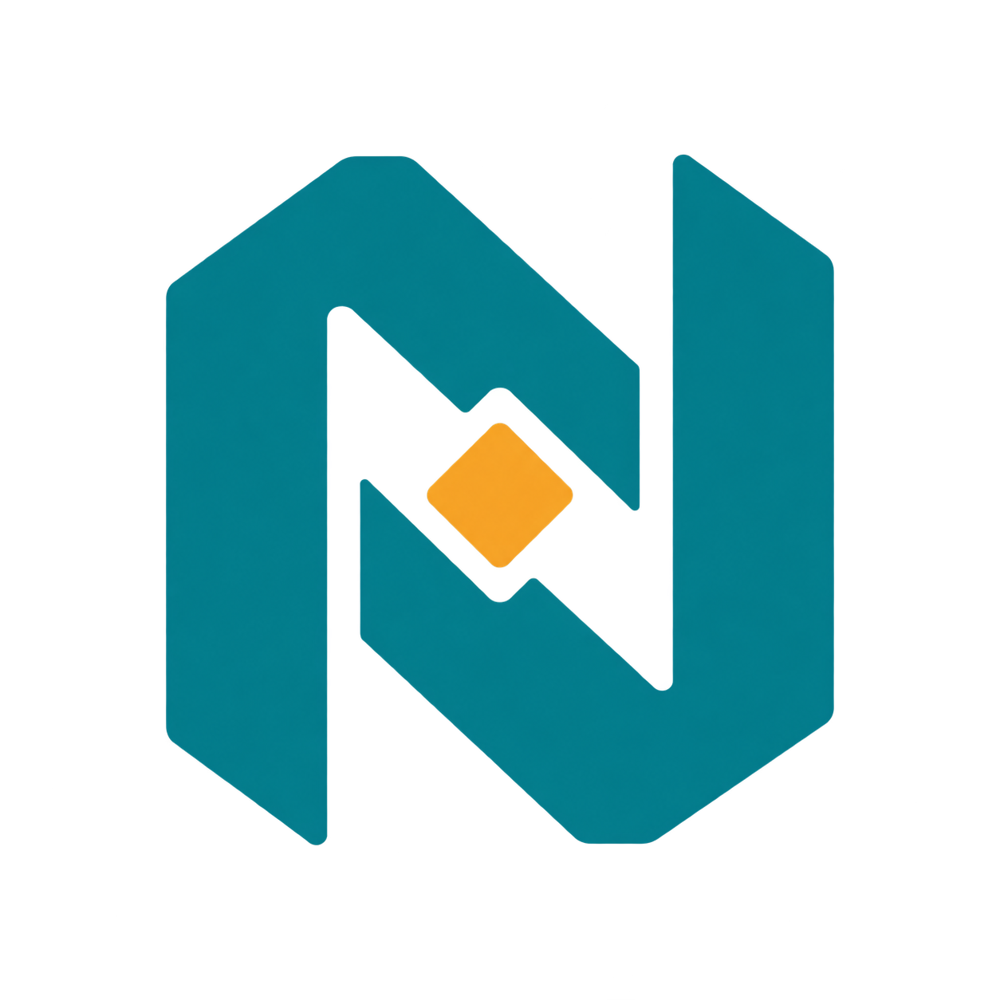

<h3 align="center"></h3>

# nuclis

A local inference engine for open-weight language models, written in Zig
with a Metal backend for Apple Silicon, and a small coding agent on top of
it. Every layer is checked against a pinned llama.cpp build before it is
made fast.


*`nuclis agent` with Qwen3.8-27B on an M4 Pro, fixing a broken function
in a small Python project, with speculative decoding on (21–27 tok/s on
the status bar while it writes). Played back in real time, pauses over
1.5 s shortened: after a 23 s warm-up the task took 36 s over seven
steps. Recorded by `scripts/agent-demo.py`.*

## Status

An experimental project, built in my free time to learn how an inference
stack works, from the GGUF bytes to the sampled token, and to learn Zig.
It has run on one machine, the version is 0.x, and breaking changes arrive
without notice. The documents record what was measured, not what was
intended. Read it as a worked notebook with a working engine inside.

## Quick start

Requires macOS on Apple Silicon, Zig 0.17.0, and the Command Line Tools.

```sh
make metal                                      # release build, Metal backend
./zig-out/bin/nuclis model pull qwen3.8-27b --all   # pinned commit, SHA-256 verified
./zig-out/bin/nuclis config init --discover     # ~/.nuclis/nuclis.json, every model found
./zig-out/bin/nuclis agent                      # the chat, with tools, in this directory
```

`nuclis generate`, `bench`, `eval`, and `tokenize` cover the rest;
`nuclis --help` lists every command and `make help` the development targets.

`make install` puts the binary in `~/.local/bin` (`PREFIX=` elsewhere), and
`nuclis completion fish|bash|zsh` prints Tab completion for that shell:

```sh
nuclis completion fish > ~/.config/fish/completions/nuclis.fish
echo 'source <(nuclis completion zsh)' >> ~/.zshrc     # after compinit
echo 'source <(nuclis completion bash)' >> ~/.bashrc
```

## Models

The catalogue pins each model's repository, commit, and SHA-256, so
`nuclis model pull <name>` fetches exactly the bytes that were measured.
Every entry reads images and carries a draft source for speculative
decoding, switched on where it measured faster.

| Family | Name | What is distinctive | Size |
| --- | --- | --- | ---: |
| Qwen3.8 | `qwen3.8-27b` | hybrid attention: 16 attention and 48 DeltaNet layers | 16.5 GB |
| Gemma 4 | `gemma-4-12b-qat` | dense, quantization-aware trained: every matrix Q4_0 | 6.7 GB |
| | `gemma-4-26b-a4b` | mixture of experts, 8 of 128 per token | 14.2 GB |
| | `gemma-4-e4b-qat` | on-device size: per-layer embeddings, shared KV layers | 4.2 GB |
| Muse Glimmer | `muse-glimmer-30b` | dense 30B with a DFlash block drafter | 15.9 GB |

Decision models, which answer typed questions instead of writing text,
have their own entries: `laya`, `laya-multilingual`, and `clef-flash`
([below](#decision-models-laya-and-clef-flash)).

**Anything else** runs when its architecture has an adapter (Qwen3.8,
Gemma 4, Muse Glimmer): finetunes, other quantizations, Gemma 4's K-quant
release, Prism ML's ternary Bonsai 2. Judge a file before downloading it,
pull it by repository, and let discovery register it:

```sh
nuclis model inspect prism-ml/Ternary-Bonsai-2-27B-gguf --file Ternary-Bonsai-2-27B-PTQ1_0.gguf
nuclis model pull prism-ml/Ternary-Bonsai-2-27B-gguf --file Ternary-Bonsai-2-27B-PTQ1_0.gguf
nuclis config init --discover   # names it, picks its prompt profile, finds its companions
```

## Results

Measured on one machine: an Apple M4 Pro (12 CPU, 16 GPU cores), 48 GiB
of unified memory, macOS 26.6.2, Zig 0.16.0, release builds, against the
pinned llama.cpp (`7620399`, Metal, flash attention, F16 cache) on the same
token arrays: 128 greedy output tokens, warm means of three runs. Tokens
per second, nuclis / llama.cpp:

| Model | Decode, 512 | Decode, 32,639 | Prefill, 512 | Prefill, 32,639 |
| --- | ---: | ---: | ---: | ---: |
| Qwen3.8-27B | 10.62 / 9.66 | 7.55 / 6.71 | 90.45 / 89.19 | 49.55 / 67.28 |
| Gemma 4 12B QAT | 23.96 / 27.69 | 16.24 / 20.94 | 179.45 / 224.46 | 73.04 / 143.72 |
| Gemma 4 26B-A4B | 55.29 / 68.02 | 31.30 / 44.09 | 500.42 / 580.76 | 134.74 / 343.38 |
| Muse Glimmer 30B | 9.60 / 13.69 | 6.62 / 9.98 | 93.49 / 95.28 | 59.20 / 76.86 |

Qwen3.8, the first target, decodes faster than the reference at every
length. The other families run on kernels written for Qwen and have not
been tuned yet; the per-kernel profiles say where the gap is. Every file
matches the reference's per-layer traces on the CPU and on Metal before
its rate is recorded.

**Speculative decoding** is on by default: a small drafter proposes a
few tokens and the model checks them in one batch, keeping what it would
have produced itself. Decode with the switch off → on, greedy, at the
entry's draft length (same M4 Pro, macOS 27.0; Qwen on 2026-10-03 from a
cooled chip, the others on 2026-10-01 from one long, warm run):

| Model | Draft | 512 | 32,639 |
| --- | ---: | ---: | ---: |
| Qwen3.8-27B | 7 | 11.5 → 17.4 (1.51×) | 8.9 → 11.2 (1.26×) |
| Gemma 4 12B QAT | 5 | 24.7 → 44.8 (1.83×) | 16.5 → 16.2 (0.98×) |
| Gemma 4 E4B QAT | 6 | 46.9 → 98.6 (2.10×) | 33.0 → 38.7 (1.16×) |
| Muse Glimmer 30B | 6 | 8.5 → 12.6 (1.50×) | 6.9 → 7.6 (1.12×) |

Short code on Qwen3.8 reaches 20 tokens/s, and the agent's task list
spends 38 % less model time. Gemma 4 26B-A4B stays off: on that mixture
of experts the batch grows dearer with every drafted token than it saves. Methodology, variance, and every
record: [docs/reference/bench.md](docs/reference/bench.md).

## Decision models: Laya and clef-flash

`nuclis decide` runs [Laya](https://huggingface.co/convaiinnovations/laya),
a small encoder that answers a typed question about a text in one pass,
with no decoding: yes/no, pick an option, or a level on a scale.

```sh
nuclis model pull laya
nuclis decide --noul 'Does this log show a failure that needs a person now?' \
  --state-file quiet.log --state-file disk.log --state-file payments.log
```

It reads fast. On Metal, `laya` reads 2,400–3,500 tokens/s and
`laya-multilingual` 3,400–8,700: a 500-token log is judged in 0.1–0.2 s,
and 50 of them in 4–10 s. Qwen3.8-27B reads the same log at 90 tokens/s
(5.7 s), so Laya can filter 30 search hits or 50 log sections and hand the
language model only the few that matter. Whether the agent gains from that
is the experiment still to run.

The answers match Laya's own Python package on the CPU and on Metal, token
for token and within 1e-4 on the logits. By hand, `laya` works as a filter:
the full disk ranks first among four logs, the eight cache misses first
among 50 entries. It also misses some plain calls, such as a scam email
scored at 0.48. `laya-multilingual` reads other languages and 1,024 tokens
but is worse on English, so `laya` is the default. Details, measurements,
and limits: [docs/reference/laya.md](docs/reference/laya.md).

[clef-flash](https://huggingface.co/Cloudflare/clef-flash), Cloudflare's
9B decision model, is the other end of the trade: a Qwen3.5 backbone (the
same hybrid DeltaNet family as Qwen3.8, at a smaller shape) with a joint
schema head that answers every question about a state in one pass. It
reads images and states up to 16,384 tokens.

```sh
nuclis model pull clef-flash --with mmproj      # backbone, head, and projector: 9 GB
nuclis decide --model clef-flash --image receipt.png --state 'Review the receipt.' \
  --noul 'Is the total legible?' --choice 'Which currency?' --option USD --option EUR
```

| | `laya` | `clef-flash` |
| --- | --- | --- |
| Model | 0.4B encoder, one pass per question | 9B Qwen3.5 backbone, every question in one pass |
| State | 512 tokens | 16,384 tokens, and images |
| One decision on Metal | 0.1–0.2 s (500 tokens) | 2.3 s (637 tokens) |
| Weights | 0.8 GB | 9 GB |
| CPU | usable | checks only (about 1 token/s) |
| Decision Index 0.2.1 (Cloudflare's card) | MMLU 30.7, BANKING77 14.3 | MMLU 91.8, BANKING77 90.9 |

So Laya is the filter over many states, and clef-flash the judge of a few
hard ones. Its sequence and head match Cloudflare's own code (the token
ids exactly, the head within 1.4e-6), CPU and Metal agree within 6e-4,
and every obvious-answer check picks the obvious option, on text and on
images. The benchmark scores are Cloudflare's, not re-measured here.
Details: [docs/reference/clef.md](docs/reference/clef.md).

`nuclis serve` keeps the models open behind a local HTTP API that speaks
TypeSafe's Jev protocol, so a Jev client only changes its base URL; a warm
decision takes 14 ms (`laya-multilingual`) to 34 ms (`laya`), and requests
that arrive together share a GPU pass. A request picks its model by name,
so one server answers with Laya and clef-flash side by side. Routes,
errors, and rates: [docs/reference/api.md](docs/reference/api.md).

```sh
nuclis serve
curl -s localhost:8000/v1/systemone -d '{"model": "jev-latest",
  "state": "Help! My payouts have been failing for 3 days.",
  "questions": {"is_urgent": {"type": "noul", "instructions": "Does this convey urgency?"}}}'
```

`nuclis serve --model clef-flash` opens clef-flash at start; a request
still names it, since the default model stays `decide.model`:

```sh
curl -s localhost:8000/v1/systemone -d '{"model": "clef-flash",
  "state": "Our checkout returns errors and orders are blocked.",
  "questions": {"team": {"type": "choice", "criteria": {"billing": "Payments", "technical": "Outages"}}}}'
```

## Documentation

- [docs/architecture.md](docs/architecture.md): how a token flows through
  the engine, the adapter seam, and where performance goes.
- [docs/spec.md](docs/spec.md): scope, requirements, acceptance criteria.
- [docs/development.md](docs/development.md): build, test gates,
  configuration, model downloads.
- [docs/reference/](docs/reference/): benchmarks, the Metal backend, GGUF,
  each model family's facts.
- [docs/llm-guide.md](docs/llm-guide.md): the concepts behind each
  component, written as they were built.
- [docs/engineering-log.md](docs/engineering-log.md): every closed unit of
  work and its evidence.

## Design rules

Explicit allocators and I/O, typed errors instead of panics, bounded
inputs and outputs, and numerical correctness before optimization.
Nothing is requantized: a file the engine cannot execute exactly is
refused. External implementations are references and validation oracles,
never sources to copy.

## Contributions

Issues are welcome: a bug with the command and artifact that reproduce it,
or a measurement from other hardware. Pull requests are not being reviewed
for now; the plan is set by what I want to understand next. Fork freely.

## Disclosure

This code is written with heavy assistance from AI coding agents, with me
directing what gets built, deciding what counts as evidence, and keeping
or discarding the result. The instructions those agents work from are
committed in [AGENTS.md](AGENTS.md), so the process is inspectable, and
every number in the documentation was measured on the machine named above,
never estimated by anyone or anything. If software built this way is not
for you, this repository is not for you.

None of it would exist without [llama.cpp](https://github.com/ggml-org/llama.cpp)
and GGML: the GGUF format is theirs, and a pinned build of llama.cpp is the
oracle every layer and kernel here is checked against. The shape of the
Metal bridge follows antirez's [ds4](https://github.com/antirez/ds4), which
also set the example of saying the AI part plainly. nuclis copies no code
from any of them; third-party material in the tree is listed in
[THIRD_PARTY_NOTICES.md](THIRD_PARTY_NOTICES.md).

## Name and licence

*nuclis* is a play on *nucleus*, Latin for "kernel": the small, dense core
where the mass is. Pronounce it like *nucleus*.

MIT, see [LICENSE](LICENSE). Model weights are not covered by it: each
artifact carries its publisher's licence, which you should check.
