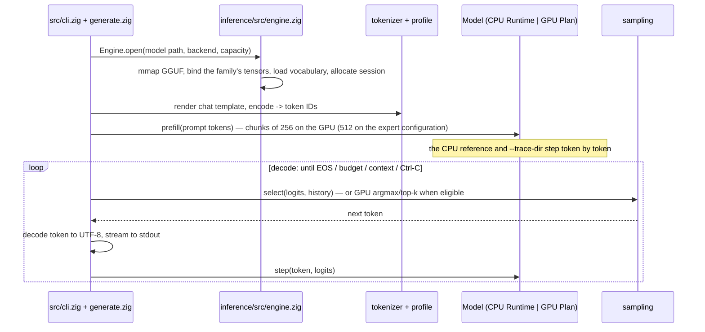
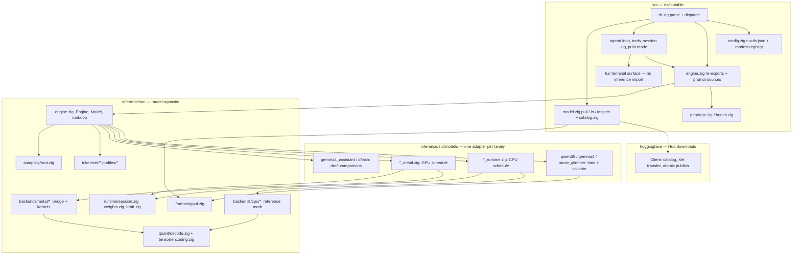
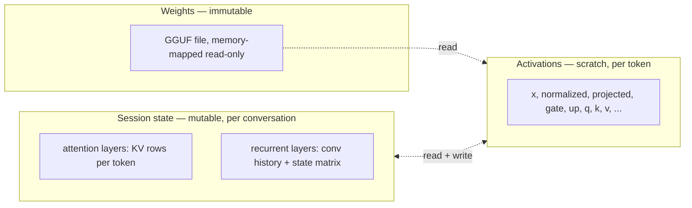
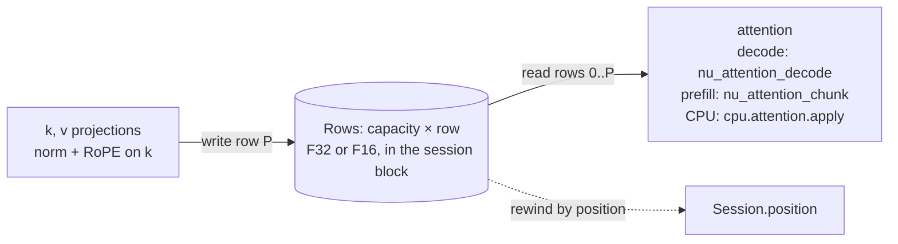
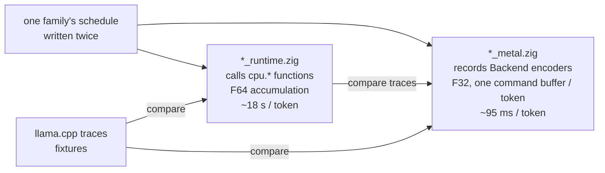
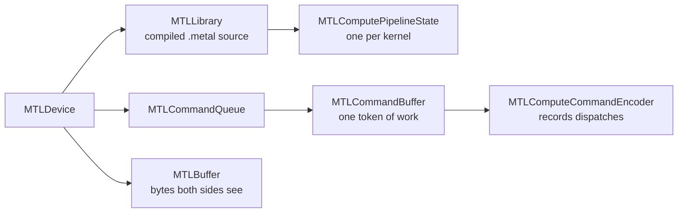
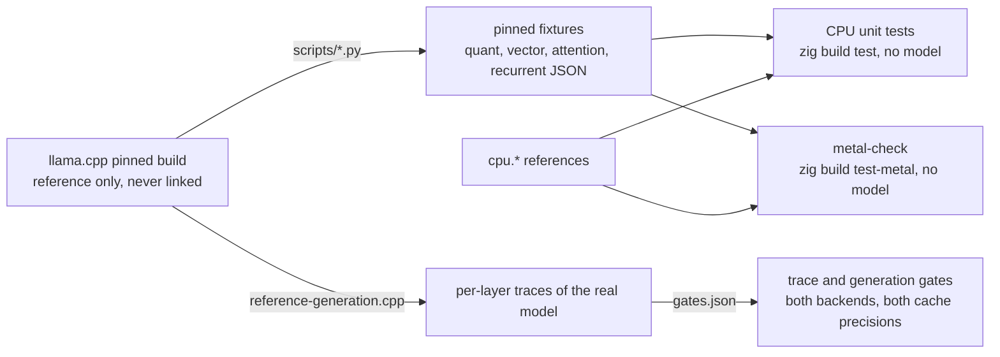
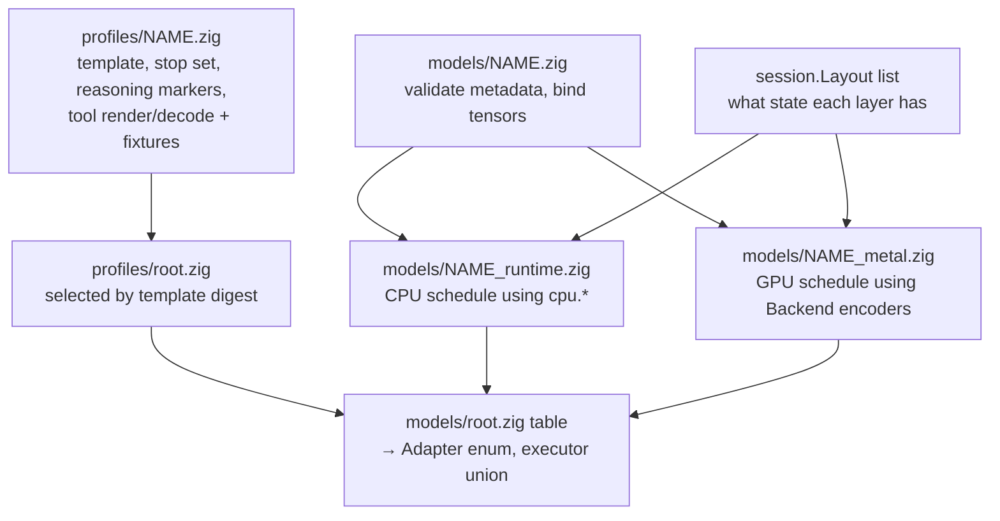

# nuclis architecture guide

The map of the engine: what the pieces are, how a token flows through them,
and where each idea lives so you can read the code next. Sections are short
by design and end with **Read** pointers; the reasoning behind the design,
with its measurements, is in [llm-guide.md](llm-guide.md), and the facts
per component are in [reference/](reference/).

nuclis has two components: the engine library under `inference/`, and the
executable under `src/`, which embeds the `generate`/`bench` CLI and the
`nuclis agent` surface on top of the engine. This guide follows the engine;
the agent appears where it touches the same interfaces.

1. [What happens when you run `nuclis generate`](#1-what-happens-when-you-run-nuclis-generate)
2. [The repository as layers](#2-the-repository-as-layers)
3. [Three kinds of memory](#3-three-kinds-of-memory)
4. [One Qwen layer](#4-one-qwen-layer)
5. [The KV cache, end to end](#5-the-kv-cache-end-to-end)
6. [Two executors, one schedule](#6-two-executors-one-schedule)
7. [Metal for a Zig programmer](#7-metal-for-a-zig-programmer)
8. [How correctness is established](#8-how-correctness-is-established)
9. [Zig constructs this codebase leans on](#9-zig-constructs-this-codebase-leans-on)
10. [Adding a model](#10-adding-a-model)
11. [Where performance goes](#11-where-performance-goes)
12. [Structural facts the code relies on](#12-structural-facts-the-code-relies-on)

## 1. What happens when you run `nuclis generate`



- **Prefill** consumes the prompt in chunks through batched kernels; only
  the last token needs logits. **Decode** feeds each generated token back
  through `step`. The session state (§3) is what makes the second token
  depend on the first.
- **Speculative decoding** replaces the step with a batch: a draft source
  proposes `k` tokens, one `verify` forward scores them all, the accepted
  prefix is kept and the session recovered to it. The switch is per
  catalogue entry ([reference/speculative-decoding.md](reference/speculative-decoding.md)).
- The CLI owns presentation, files, timing, and cancellation, never
  weights or math. The loop, `Engine`, and the `Model` union live in the
  library so `generate`, `bench`, and the agent share one API; the
  executable reaches in through `Hooks`, the layer `Observer`, and the
  Metal backend's `tick`.
- A token is an integer id into the vocabulary; text exists only at the
  edges (`tokenizer/encode.zig` in, `tokenizer/stream.zig` out).

**Read:** `inference/src/engine.zig` (`runLoop`, `speculativeBatch`),
[reference/generation.md](reference/generation.md).

## 2. The repository as layers



**Arrows only point down.** Shared modules never import an adapter;
adapters never import the executable. `models/` is the one place that knows
a family by name; `src/` is the one place that knows files, terminals,
signals, and the network.

| Layer | Knows about | Must not know about |
| --- | --- | --- |
| `formats/gguf` | bytes, offsets, metadata types | what a tensor name means |
| `quant`, `tensor` | block layouts, decode equations | which tensor is which |
| `tokenizer`, `profiles` | vocabularies, merges, the chat template, tool grammar | layers, kernels |
| `runtime/session` | "a layer has KV rows" or "recurrent state" | how big, or why |
| `runtime/draft` | that a family can propose tokens and advance over committed ones | how it predicts |
| `backends/cpu`, `backends/metal` | one operation at a time, shapes as parameters | layer order |
| `models/*` | everything above, composed in one family's order | terminals, files |
| `engine` | composing adapters, backends, tokenizer, sampler into `open`/`step`/`runLoop` | files, terminals, signals |
| `src` | arguments, configuration, stdout, Ctrl-C, presentation, downloads | equations |
| `huggingface` | the Hub API, Xet reconstruction, digests, atomic publication | what a GGUF means |

**Read:** [spec.md § Module ownership](spec.md#module-ownership),
[development.md](development.md).

## 3. Three kinds of memory



| Kind | Where | Owner | Lifetime | Zig type |
| --- | --- | --- | --- | --- |
| Weights | the file, mapped by `runtime/weights.zig` | `Mapped` | the process | `[]const u8` views, never expanded |
| Session state | one page-aligned block, `runtime/session.zig` | `Session` | until `reset()` | `Rows` (F32 or F16 KV rows), `[]f32` recurrent state; a draft source's cache is one more layout |
| Activations | arena (CPU) or GPU buffers (Metal) | the executor | one `step` | scratch |

- **Weights stay quantized.** A kernel decodes each block on the way into
  the multiply; there is never a floating-point copy of the model.
- **Session state is not only a KV cache.** Recurrent layers hold a matrix
  overwritten in place every token; it cannot be rewound by truncating a
  length. The session offers `snapshot`/`restore` and, inside a speculative
  batch, `checkpoint`/`rewind`/`truncate`.
- **The session is a state machine**: `ready → updating → ready`, or
  `failed` until `reset()`, so a half-finished token is never mistaken for
  committed state.

**Read:** [reference/session.md](reference/session.md),
`runtime/session.zig`, `runtime/weights.zig`.

## 4. One Qwen layer

```mermaid
flowchart TB
    xin[x in] --> n1[RMSNorm × attention_norm]
    n1 --> mixer{layer % 4 == 3 ?}
    mixer -- yes --> attn[Full attention]
    mixer -- no --> delta[Gated DeltaNet]
    attn --> add1[x += projected]
    delta --> add1
    add1 --> n2[RMSNorm × post_attention_norm]
    n2 --> ffn[gate = W_gate·n, up = W_up·n\ngate = silu(gate) · up\nprojected = W_down · gate]
    ffn --> add2[x += projected] --> xout[x out]
```

- **Full attention** (16 of 64 layers): project q with its gate, k, v;
  norm and RoPE q and k; write k/v at the current position; attend over
  the visible prefix with 6 query heads per KV head; gate; project out.
- **Gated DeltaNet** (48 layers): project qkv, z, β, α; a causal
  convolution over the last 4 inputs; L2-normalize q and k; per head,
  update a 128 × 128 matrix (`S ← a·S; S += β·(v − S·k)·kᵀ; out = S·q`);
  norm × `silu(z)`; project out.
- In prefill both mixers are batched over a chunk: attention as a causal
  tile, DeltaNet through its chunkwise form.

The other families on the same wrapper:

| Family | Layers | Mixers | What is different |
| --- | --- | --- | --- |
| Gemma 4 12B | 48 | sliding-window attention (1,024) and global attention with 512-wide heads | tanh GELU, RoPE factors, scaled residuals, capped logits ([reference/gemma4.md](reference/gemma4.md)) |
| Gemma 4 26B-A4B | 30 | as the 12B | the feed-forward is 128 experts, 8 active per token ([reference/gemma4.md § 26B-A4B](reference/gemma4.md#gemma-4-26b-a4b-the-expert-configuration-modl-09)) |
| Muse Glimmer 30B | 52 | 39 windowed (2,048), 13 global | dense; the `llama4` tokenizer splitter ([reference/muse-glimmer.md](reference/muse-glimmer.md)) |
| Bonsai 2 27B | 64 | Qwen's | ternary weights in a Hadamard-rotated basis ([reference/bonsai.md](reference/bonsai.md)) |

**Read:** [reference/cpu-reference.md](reference/cpu-reference.md) (the
equations and tolerances), `models/qwen35_runtime.zig` (`fullAttention`,
`linearAttention`), [llm-guide.md § 9](llm-guide.md#9-attention-reads-deltanet-writes).

## 5. The KV cache, end to end

The cache is not a module. It is a storage contract in the session,
written by each adapter's two schedules, read by the attention kernels.



| Step | Where |
| --- | --- |
| Declared | `Layout.attention { key_row, value_row, precision }` per layer; the session carves `capacity` key rows and value rows from the block (`runtime/session.zig`) |
| Viewed | `Rows.range(first, count)`: the byte range a GPU binds; `Rows.floats(first, count)`: the F32 view the CPU reads (asserts F32) |
| Written | after the key norm and RoPE, at row `position`: `fullAttention` on the CPU; the Metal plan projects into the slot (F32) or through scratch and `nu_pack_half` (F16); prefill writes a chunk of rows |
| Read | rows `[0, position + 1)`, or a window's suffix: `nu_attention_decode` (each row once per KV head group, online softmax in registers), `nu_attention_chunk` (a chunk tiled against the visible rows), `cpu.attention.apply` |
| Rewound | by position: rows past it are never read, so `Session.truncate` is a number, not a copy; recurrent layers cannot do this |

The precision is `engine.kv_precision`, F16 by default on the GPU: half
the block and half the bytes each decode step streams, at a rounding the
trace gates bound per mode. `--kv f32` is for numerical work.

**Read:** [reference/session.md](reference/session.md),
[llm-guide.md § 20](llm-guide.md#20-half-the-bytes-the-f16-cache) and
[§ 21](llm-guide.md#21-flash-decoding), `Backend.attentionDecode` and
`attentionChunk` in `backends/metal/root.zig`.

## 6. Two executors, one schedule



- `*_runtime.zig` is the **reference**: plain loops, F64 sums, every
  operation a pure function in `backends/cpu/` with its own tests. Slow on
  purpose; when the two disagree it is presumed right.
- `*_metal.zig` is the **engine**: the same schedule, each line recording
  a dispatch; nothing runs until `commit()`. The files are deliberately
  parallel so they can be read side by side.
- `engine.zig` wraps both in a `Model` union with `step`, `prefill`,
  `verify`, and `reset`, so callers never care which is underneath.
- The schedule is written twice by decision. Three families showed that
  what varies between them is parameters and instantiations of existing
  kernels, not operation order, so a shared op list was not extracted.

**Read:** [reference/metal-backend.md § Execution model](reference/metal-backend.md#execution-model),
[reference/generation.md § Numerical traces](reference/generation.md#numerical-traces).

## 7. Metal for a Zig programmer



| Metal object | Our name | Where |
| --- | --- | --- |
| device, queue, library, pipelines, buffers, the current command buffer and encoder | `NuMetal` | `bridge.m` |
| `nu_metal_create` / `_destroy` | `Backend.init` / `deinit` | `root.zig` |
| `nu_metal_pipeline(name)` | compiled once per kernel at init | `root.zig` `kernel_names` |
| `nu_metal_buffer_create` / `_wrap` | `Backend.create` / `wrap` → `Buffer{id, offset, len, host}` | `root.zig` |
| `nu_metal_begin` / `_dispatch` / `_commit` | `Backend.begin` / typed encoders / `commit` | `root.zig` |

- **A kernel is a function run by many threads at once.** Zig chooses the
  grid and thread count and holds the constants the kernels assume; only
  `kernels.metal` names a lane or a SIMD group. The three kernel shapes
  (reductions, tiles on the matrix unit, elementwise) and every kernel's
  geometry are tabulated in [reference/metal-backend.md § Kernel geometry](reference/metal-backend.md#kernel-geometry).
- **Unified memory.** The GPU addresses the mapped file and the session
  block directly through `newBufferWithBytesNoCopy`, page-aligned, with no
  copy. The mapping must outlive the backend.
- **Synchronization is a cost like bandwidth.** One command buffer per
  token; the CPU may touch session memory only after `commit()` returns.
  The wait is a semaphore with a 100 ms timeout that calls the backend's
  optional `tick`, which is how the agent repaints during a long prefill
  chunk at no cost to a decode step.
- Objective-C appears only in `bridge.m`, without automatic reference
  counting, so every retain and release is explicit.

**Read:** [reference/metal-backend.md](reference/metal-backend.md),
[llm-guide.md § 11–§ 13](llm-guide.md#11-crossing-the-bridge), `bridge.m`,
then `kernels.metal` from `nu_add` and `nu_rmsnorm` before `nu_matvec`.

## 8. How correctness is established



- **Unit tests** (`make test`) run without a model or GPU under a
  leak-checking allocator, including on error paths.
- **Fixtures** are outputs of the reference on small inputs, committed with
  the revision that produced them. Decoders must match exactly; F32 GPU
  reductions match F64 sums within stated tolerances.
- **Full-model traces** compare every layer output and the logits on real
  prompts, with a documented tolerance per numerical mode.
- **Gates and workloads are data.** Every model-specific check is a gate in
  `gates.json`, tiered by cost and selected by changed paths; every
  benchmark is a workload in `workloads.json` with its report saved by
  revision, and the record tables are generated from those reports.
- **Bench** is the only source of performance claims and reports what it
  could not measure as absent, not zero.

**Read:** [development.md § Gates](development.md#gates) and
[§ The record](development.md#the-record),
[reference/bench.md](reference/bench.md), `inference/metal-check.zig`.

## 9. Zig constructs this codebase leans on

| Construct | Why here | Read |
| --- | --- | --- |
| Explicit allocators | No hidden heap; tests inject a leak-checking allocator | `runtime/session.zig` `init` |
| `errdefer` | Undo partial initialization when a later step fails | `engine.zig` `Engine.open` |
| `defer` with `deinit` | Release at scope exit, in reverse order | `generate.zig` `run` |
| Tagged unions with `switch` | A layer is attention *or* recurrent; both cases must be handled | `session.zig` `Layout`, `engine.zig` `Model` |
| Error sets and `try` | Expected failures are values, not panics | `quant/decode.zig` |
| Slices | Borrowed views with a length; doc comments say who owns the memory | `runtime/weights.zig` `View` |
| `comptime` and `@embedFile` | Fixtures and shader source compiled in; the IQ3_S grid becomes MSL text at compile time | `backends/metal/root.zig` `iq3_grid_source` |
| `extern fn` + `*anyopaque` | Calling Objective-C through an opaque handle | `backends/metal/root.zig` |
| `extern struct` | C layout, passed as kernel constants byte for byte | `Backend.MatvecParams` |
| `std.Io` passed explicitly | File, clock, and cancellation through an injected interface | `generate.zig` `Trace` |
| `checkAllAllocationFailures` | Every allocation site fails once in a test | `session.zig` tests |
| Explicit casts | Every conversion visible and checked in safe builds | `quant/decode.zig` `half` |
| Arena allocator | Many allocations with one lifetime | `qwen35_runtime.zig` `storage` |
| `inline for` over struct fields | The configuration schema is a struct walked at compile time | `src/config.zig` |
| Callback `context: *anyopaque` | Callbacks without closures | `runtime/observer.zig`, `engine.zig` `Hooks` |
| `@Enum` / `@Union` from a table | The adapter enum and executor union are derived from one list of families | `models/registry.zig`, `engine.zig` `Executors` |
| `std.atomic.Value` + `callconv(.c)` | A Ctrl-C flag set by a signal handler, read between layers | `src/interrupt.zig` |
| Overflow-checked arithmetic | Sizes from untrusted files return `error.Overflow` | `formats/gguf.zig`, `session.zig` |
| Aligned allocation in the type | The session block is page-aligned so the GPU wraps it with no copy | `runtime/session.zig` |

The habit behind all of them: validate everything, then write nothing
until validation passes, so a failure leaves caller buffers untouched.

**Read:** the Zig language reference installed with the compiler,
[development.md § Toolchain](development.md#toolchain).

## 10. Adding a model



| You add | You do not touch |
| --- | --- |
| an adapter (`bind`, the CPU runtime, the Metal plan) and one line in `models/root.zig` `table` | `formats/gguf`, `quant`, `tokenizer/bpe`, `sampling`, `session`, `bridge.m`, the existing kernels, `generate`/`bench` |
| a profile selected by the template's digest, with fixtures from the reference server | the agent loop, the tool registry, the events, the transcript, the diff, the session log |
| genuinely new mathematics as a `cpu.*` function with fixtures plus a kernel with a `metal-check` entry | anything above or below that operation |
| a draft companion implementing `runtime/draft.zig`, when the family has one | the speculative loop |

What the families that went through the seam actually needed:

| Case | New | Reference |
| --- | --- | --- |
| Gemma 4 12B | `cpu.gelu`, RoPE factors; on the GPU four scalar epilogues, a GELU pair mode, a window parameter on the chunk attention, a wider instantiation of decode attention, a `tanh` clamp | [gemma4.md](reference/gemma4.md) |
| Gemma 4 26B-A4B | not a second adapter: `gemma4.configs` selects by block count; `cpu.experts` and the gathered kernels; `weights.View.expertMatrix`; a per-plan `preferredChunk` | [gemma4.md § 26B-A4B](reference/gemma4.md#gemma-4-26b-a4b-the-expert-configuration-modl-09) |
| Q4_0 (the QAT file) | a `quant.row` arm, a generic GPU decoder, a specialized matvec and tile, the adapter's `executableEncoding` claim | [gemma4.md § Q4_0 path](reference/gemma4.md#q4_0-path-and-the-qat-file-modl-08-2026-09-12) |
| Muse Glimmer 30B | a tokenizer splitter, a windowed schedule with global layers, a profile with a reasoning channel and its own tool grammar; no new kernel | [muse-glimmer.md](reference/muse-glimmer.md) |
| Bonsai 2 27B | two ternary encodings, the Hadamard transform, a rotation contract in the Qwen adapter; the Qwen plan otherwise | [bonsai.md](reference/bonsai.md) |
| draft sources | Qwen's embedded block; `gemma4_assistant.zig`, a second GGUF reading the target's caches; `dflash.zig`, a block drafter | [speculative-decoding.md](reference/speculative-decoding.md) |

Registration is one line: the adapter publishes a `family` namespace
(`architecture`, `executableEncoding`, `Binding`/`bind`, `Runtime`, `Plan`)
and `models/root.zig` lists it; the `Adapter` enum, the executor union,
`model inspect`'s verdict, and `nuclis validate` derive from that table.
Profiles register the same way and own everything template-specific: the
stop set, the reasoning markers, and the tool path in both directions.
Nothing under `src/` names an adapter or a profile module.

**Read:** [reference/new-model-guide.md](reference/new-model-guide.md)
(the order of work), [reference/prompt-profile.md](reference/prompt-profile.md),
[reference/tool-calling.md](reference/tool-calling.md),
[llm-guide.md § 24–§ 25](llm-guide.md#24-the-registry-table).

## 11. Where performance goes

Decode is bound by reading weights: 16.1 GB per token over a 273 GB/s bus
is about 59 ms, a ceiling near 17 tok/s.

```mermaid
flowchart LR
    m1[sync per-op bridge\n2.3 tok/s] --> m2[one command buffer / token\n5.0] --> m3[specialized matvec\n8.5] --> m3b[no per-layer commits\n9.7] --> m4[Q3_K/IQ3_S kernels,\nmerged projections\n10.6] --> m6[GPU sampling\nsampled = greedy speed] --> p1[chunked prefill matmul\n11 → 51 tok/s at 512] --> p2a[tiled causal attention\n33 → 51 at 4K] --> p2b[chunkwise DeltaNet] --> p3[half tiles\n53 → 84 at 512] --> m5[F16 KV + flash decoding\n32K decode 2.65 → 8.09] --> m7[penalty kernel\ninstruct 8.7 → 10.2] --> s1[speculative decoding\nMuse 1.16–1.23×]
```



| Record (Qwen3.8-27B, Metal, F16 cache) | decode tok/s | prefill tok/s |
| --- | ---: | ---: |
| 512-token context | 10.62 | 90.45 |
| 4,096-token context | 10.20 | 83.70 |
| llama.cpp on the same token arrays, 512 | 9.66 | 89.19 |

Levers that were built, measured, and kept out, each with its table in the
record: a multi-row matvec that wins only at 2 rows, a wider small-batch
tile, a split-K matvec, register-reuse prefill attention (shipped only for
the 1–64-row batches speculation verifies), fused decode norms (shipped
for the dispatch count, not for speed), and the speculative switch on
Qwen and Gemma, where the verifier's row-flat cost outweighs the accepted
drafts.

**Read:** [reference/bench.md](reference/bench.md),
[reference/metal-backend.md](reference/metal-backend.md),
[llm-guide.md § 13](llm-guide.md#13-the-matvec-that-reads-16-gb) and
[§ 23](llm-guide.md#23-guessing-ahead-and-paying-to-check),
[../TODO.md](../TODO.md) for what is next.

## 12. Structural facts the code relies on

Each is enforced or documented in the file it names.

- **Kernel binding convention:** data buffers at indices 0–6, the
  parameter struct at 7. The `Backend` encoders in `backends/metal/root.zig`
  are the only place that knows kernel names and argument order.
- **Specialized matvecs** are chosen per encoding when `specializedMatvec`
  accepts the row alignment; `rows_per_simdgroup` and
  `simdgroups_per_matvec_group` must match the kernel template constants.
- Every `Backend` function starts with `if (!enabled) return
  error.MetalNotEnabled;` so non-Metal builds link.
- `Observer` has three optional callbacks: `check` (no activations, runs
  while recording), `layer` (activations, forces a commit per layer, trace
  runs only), `progress` (a call per chunk and per token). Never install
  `layer` on a production path.
- `Backend.tick` is called from `commit` only while a buffer runs longer
  than 100 ms, on the calling thread, and must not touch the backend or
  the model.
- **Profiling** uses one encoder per dispatch because Apple GPUs stamp only
  encoder boundaries; stamps are nanoseconds on the `GPUStartTime`
  timeline; a profiled run's tok/s is not comparable.
- Weights are wrapped per tensor, not as one buffer (one buffer made GPU
  time swing 3–4×; documented in `models/qwen35_metal.zig`).
- `Session` is one page-aligned block with typed views; attention rows are
  F32 or F16 by layout, recurrent state F32, regions on 16-byte boundaries.
  `snapshot`/`restore` require an equal layout digest and capacity; a
  checkpoint region and per-row recurrent checkpoints serve the
  speculative batch. **GPU-idle invariant:** no command buffer in flight
  when the CPU touches session memory.
- Prefill chunk buffers hold `matmulPadded(chunk)` rows; `nu_attention_chunk`
  reads exactly `position + count` cache rows; a nonzero `window` masks
  per row and the caller may slice the cache at the earliest visible key;
  value widths above 256 take one threadgroup per 256 columns.
- Decode attention is `nu_attention_decode` + `nu_attention_merge`: grid
  (KV head, head group, split), each cache row read once per head group;
  the `_w`/`_wh` instantiations serve widths up to 512.
- Metal's `tanh` returns NaN past about ±44; every kernel goes through
  `nu_tanh`, clamped at ±20 where F32 tanh is exactly ±1.
- A plan's `deinit` calls `Backend.unwrap` on its session memory: `wrap`
  caches by address and refuses a second length at the same address.
- The DeltaNet GPU update is nontransactional; correctness after a failure
  relies on `Session` poisoning until `reset()`.
- **Speculation:** `verify` feeds `1 + k` rows through the prefill path with
  every row's logits (or the device top-k per row) retained; acceptance
  draws the target's own token per row; recovery is a slot copy. A draft
  source is a session layout like any layer.
- **Sampling:** `sampling.History` is session state owned by the caller
  and reset wherever the session is; the sampler is policy only; the
  per-mode defaults live in the profile. A penalty runs through the device
  kernel before the top-k.
- **Adapters and profiles are tables.** `models.table` builds the enum, the
  union, and the known list; `profiles.forDocument` picks by template
  digest; the stop set and the completion decoder are the profile's.
- **The terminal surface** imports nothing from `inference`; only
  `tui.terminal` touches the OS and only `tui.screen` emits a movement
  escape, which is why its golden tests need no TTY. The agent's typed
  events are consumed three times: the transcript (each closed block
  written exactly once), the status bar, and print mode.
- **Decided:** F16 KV is the GPU default and the CPU reference stays F32;
  greedy decode uses GPU argmax; sliding caches are allocated for the full
  capacity; the ternary matvec keeps its arithmetic.

**Read:** [reference/metal-backend.md](reference/metal-backend.md),
[reference/session.md](reference/session.md), `runtime/session.zig`.
