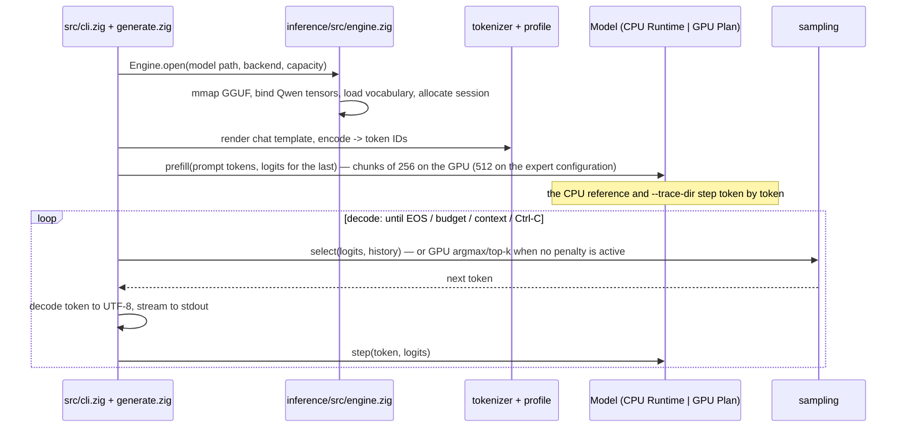
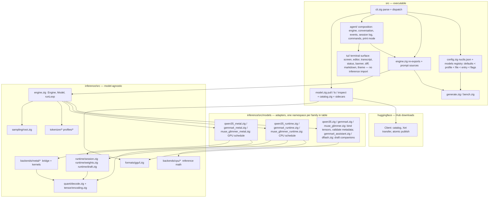
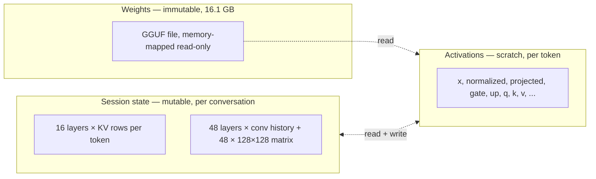
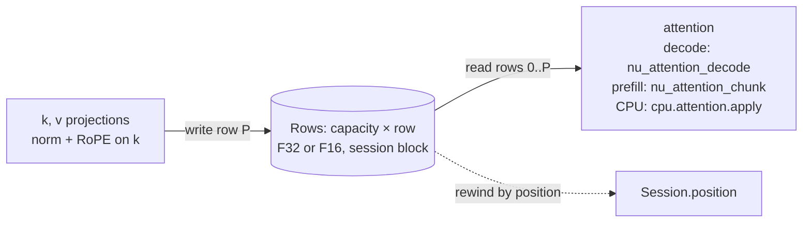
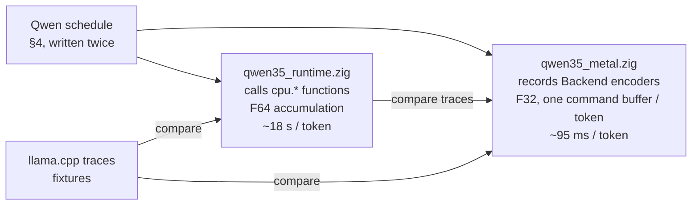
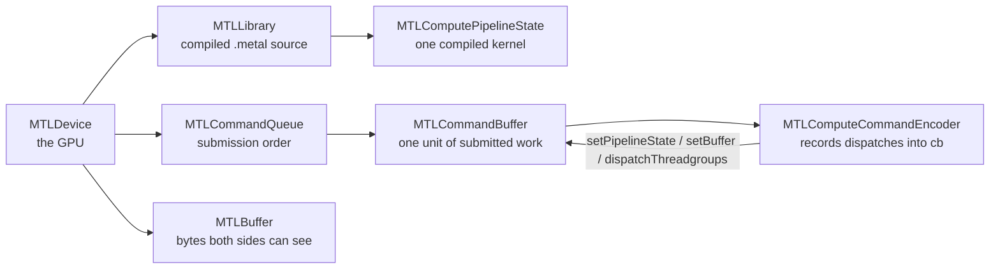
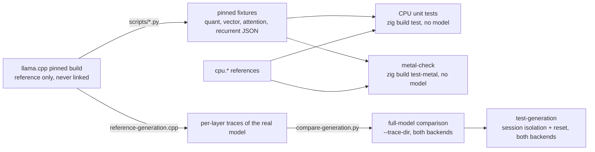
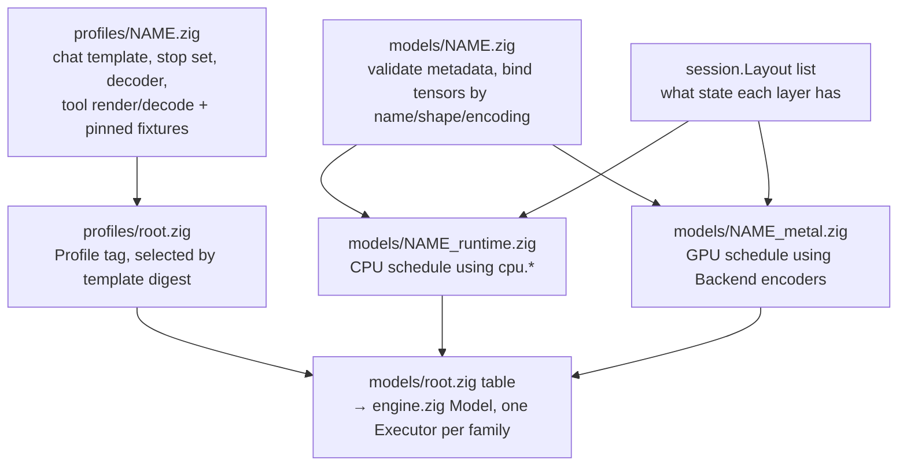

# nuclis architecture guide

This is the map of the inference engine: what the pieces are, how a token
flows through them, and where each idea is implemented so you can read the
code next. Every section is short on purpose and ends with **Dive deeper**
pointers. Diagrams are Mermaid and render on GitHub.

nuclis has two components: the engine library under `inference/`, and the
executable under `src/`, which embeds the `generate`/`bench` CLI and the
`nuclis agent` surface on top of the engine. This guide follows the engine;
the agent appears where it touches the same interfaces.

Read in order the first time. Later, jump to the section you need.

1. [What happens when you run `nuclis generate`](#1-what-happens-when-you-run-nuclis-generate)
2. [The repository as layers](#2-the-repository-as-layers)
3. [Three kinds of memory](#3-three-kinds-of-memory)
4. [One Qwen layer](#4-one-qwen-layer)
5. [The KV cache, end to end](#5-the-kv-cache-end-to-end)
6. [Two executors, one schedule](#6-two-executors-one-schedule)
7. [Metal for a Zig programmer](#7-metal-for-a-zig-programmer)
8. [How correctness is established](#8-how-correctness-is-established)
9. [Zig constructs this codebase leans on](#9-zig-constructs-this-codebase-leans-on)
10. [Adding a model](#10-adding-a-model)
11. [Where performance goes](#11-where-performance-goes)
12. [Structural facts the code relies on](#12-structural-facts-the-code-relies-on)

## 1. What happens when you run `nuclis generate`



- **Prefill** consumes the prompt; only the last token needs logits. On the
  GPU it runs in chunks through batched matrix kernels (ENGN-02, ENGN-05: half
  operands in 64×64 tiles), reading each weight once per 64 tokens instead
  of once per token, with one causal
  tiled attention dispatch (ENGN-03) and one chunkwise DeltaNet dispatch (ENGN-04)
  per layer and chunk. **Decode** feeds each
  generated token back in through `step`. The model's state (§3, §5) is what
  makes the second token depend on the first, whichever path produced it.
- A token is an integer ID into a 248,320-entry vocabulary. Text is only
  produced at the edges: `tokenizer/encode.zig` on the way in,
  `tokenizer/bpe.zig` + `tokenizer/stream.zig` on the way out.
- The CLI never touches weights or math. It owns presentation, files, timing,
  and cancellation (`interrupt.zig`). The loop itself, `Engine`, and the
  `Model` union live in the library (`inference/src/engine.zig`, moved there
  in ENGN-01) so `generate`, `bench`, the agent, and any future consumer share
  one API; the executable reaches in through `Hooks`, the layer observer, and
  the Metal backend's `tick` (a callback every 100 ms of GPU wait, which is
  how the agent repaints during a long prefill chunk).
- With `--speculative on` `runLoop` takes `speculativeBatch` steps instead: a draft
  source proposes `k` tokens, one batched `verify` forward scores them all,
  the accepted prefix is kept and the session recovered to it (§5). Each
  family names its own draft source through `runtime/draft.zig`; the
  catalogue records per entry whether it pays (Muse yes, Qwen and Gemma no).

**Dive deeper:** [reference/generation.md](reference/generation.md),
[llm-guide.md §2 and §10](llm-guide.md),
`inference/src/engine.zig` (`runLoop` is the whole loop in ~70 lines).

## 2. The repository as layers



The rule that keeps this honest: **arrows only point down**. Shared modules
never import a model adapter; adapters never import the executable. The one
place that knows a family by name is `models/`; the one place that knows
about files, terminals, signals, and the network is `src/` (the
`huggingface` package is its download library, imported by nothing else).

| Layer | Knows about | Must not know about |
| --- | --- | --- |
| `formats/gguf` | bytes, offsets, metadata types | tensor names' meaning |
| `quant`, `tensor` | block layouts, decode equations | which tensor is which |
| `tokenizer`, `profiles` | vocabularies, merges, chat template | layers, kernels |
| `runtime/session` | "a layer has KV rows" or "a layer has recurrent state" | how big, or why |
| `runtime/draft` | that a family can propose tokens and advance over committed ones | how a family predicts, or the generation loop |
| `backends/cpu`, `backends/metal` | one operation at a time, with shapes as parameters | layer order |
| `models/qwen35*`, `models/gemma4*`, `models/muse_glimmer*` | everything above, composed in one family's order; the draft companions beside them | terminals, files |
| `engine` | composing adapters, backends, tokenizer, and sampler into `open`/`step`/`runLoop` | files, terminals, signals |
| `src` | arguments, the configuration file, stdout, Ctrl-C, agent presentation, model downloads and their provenance | equations |
| `huggingface` | the Hub API, Xet reconstruction, SHA-256 verification, atomic publication | what a GGUF means, where nuclis keeps configuration |

**Dive deeper:** [spec.md § Module ownership](spec.md#module-ownership),
[development.md](development.md).

## 3. Three kinds of memory

Everything the engine holds falls into one of three categories with different
owners and lifetimes. Getting these apart is most of the design.



| Kind | Where | Who owns | Lifetime | Zig type |
| --- | --- | --- | --- | --- |
| Weights | the file, mapped by `runtime/weights.zig` | `Mapped` | whole process | `[]const u8` views; never copied to F32 |
| Session state | one page-aligned byte block in `runtime/session.zig` | `Session` | until `reset()` | typed views carved from one allocation: `Rows` (F32 or F16 KV rows) and `[]f32` recurrent state; a draft source's own cache is one more layout in the same block |
| Activations | arena (CPU) or GPU buffers (Metal) | the executor | one `step` | scratch, overwritten every token |

Two consequences worth internalizing:

- **Weights stay quantized.** A matvec decodes each block on the way into the
  multiply. There is never a floating-point copy of the model; the 16 GB is read
  from the mapping (CPU) or through a no-copy Metal buffer over the same pages.
- **Session state is not just a KV cache.** 48 of 64 layers are recurrent:
  their memory is a fixed-size matrix updated in place every token. You cannot
  "rewind" it by truncating a length; the spec forbids that, and the
  session offers `snapshot`/`restore` instead (ENGN-06): a caller-owned copy of
  the used extent, restored only into a session of the same capacity and
  layout. A speculative verify batch needs the cheaper in-block
  `checkpoint`/`rewind`/`truncate` (ENGN-11): a page-aligned region holding one
  recurrent copy, restored by `rewind`, while attention-only state is rewound
  by position with `truncate`. `Session` has a tiny state
  machine — `ready → updating → ready`, or `failed` until `reset()` — so a
  half-finished token can never be mistaken for committed state.

**Dive deeper:** [reference/session.md](reference/session.md),
[llm-guide.md §2, §9, §10, §22](llm-guide.md),
`runtime/session.zig`, `runtime/weights.zig`.

## 4. One Qwen layer

The pinned model has 64 decoder layers. Every fourth layer is ordinary
attention; the other 48 are Gated DeltaNet, a recurrent mixer. Both share the
same wrapper: norm → mixer → residual → norm → feed-forward → residual.

```mermaid
flowchart TB
    xin[x in] --> n1[RMSNorm × attention_norm]
    n1 --> mixer{layer % 4 == 3 ?}
    mixer -- yes --> attn[Full attention]
    mixer -- no --> delta[Gated DeltaNet]
    attn --> add1[x += projected]
    delta --> add1
    add1 --> n2[RMSNorm × post_attention_norm]
    n2 --> ffn[gate = W_gate·n, up = W_up·n\ngate = silu(gate) · up\nprojected = W_down · gate]
    ffn --> add2[x += projected] --> xout[x out]
```

**Full attention** (16 layers): project `qg` (24 heads × [256 query | 256
gate]), `k` and `v` (4 heads × 256). Normalize and RoPE-rotate q and k, write
k/v into the cache at the current position, attend over all visible positions
(grouped-query: 6 query heads share each KV head), multiply by `sigmoid(gate)`,
project out.

**Gated DeltaNet** (48 layers): project `qkv` (10,240), `z` (6,144), `β` (48),
`α` (48). Run a depthwise causal convolution over the last 4 inputs (history
kept in state), SiLU, L2-normalize the 32 Q/K heads, turn α/β into a decay and
a learning rate, then for each of 48 heads update a 128×128 matrix:

```text
S ← a·S
S ← S + β · (v − S·k) · kᵀ        (write the prediction error into memory)
out = scale · S·q                 (read the updated memory with the query)
```

Then RMSNorm × `silu(z)` and project out. The 16 Q/K heads are broadcast to 48
value heads by `h % 16`, unlike attention's consecutive grouping — an example
of a detail the fixtures caught.

The two mixers are why the session has two layouts, and why decode cost grows
slowly with context: only 16 layers read a history that grows. In prefill
both mixers are batched over a chunk: attention as a causal tile, DeltaNet
through the chunkwise form that turns the per-token matrix update into
inner products between the chunk's keys ([llm-guide.md §18](llm-guide.md#18-deltanet-in-chunks-the-triangular-solve)).

**Dive deeper:** [llm-guide.md §9](llm-guide.md#9-attention-reads-deltanet-writes),
[reference/cpu-reference.md](reference/cpu-reference.md)
(the exact equations and tolerances), `models/qwen35_runtime.zig`
(`fullAttention`, `linearAttention` — 60 lines that *are* the layer).

## 5. The KV cache, end to end

A full-attention layer remembers every token it has seen as one key row
and one value row. The cache is those rows for every attended layer, and
nothing about it is a module of its own: it is a storage contract in the
session, written by each adapter's two schedules, and read by the attention
kernels. Following one token through it is the fastest way to see how the
pieces fit.



- **Declared** by the adapter as a layout: `Layout.attention { key_row,
  value_row, precision }` per layer in `runtime/session.zig`; the session
  carves `capacity` key rows and `capacity` value rows for each out of the
  page-aligned block. `Rows.range(first, count)` is the byte range a GPU
  binds; `Rows.floats(first, count)` is the F32 view the CPU reference reads
  (it asserts F32: the reference never runs on a half cache).
- **Written** once per token per layer, at the current position, after the
  key norm and RoPE. CPU: `qwen35_runtime.zig` `fullAttention` copies `k`
  and `v` into row `position`. Metal: `qwen35_metal.zig` projects straight
  into the cache slot for an F32 cache, or through F32 scratch rows and one
  `nu_pack_half` dispatch for F16; prefill writes a whole chunk of rows the
  same way. Gemma's sliding layers and Muse's windowed layers write the same
  rows and *read* a suffix slice of them.
- **Read** by the attention over rows `[0, position + 1)` (or the window's
  suffix): `nu_attention_decode` streams every row once per KV head group
  with the online softmax in registers (KERN-08, §11), `nu_attention_chunk`
  tiles a prefill chunk against the visible rows (ENGN-03), and the CPU
  reference's `cpu.attention.apply` takes the F32 view. The half
  instantiations convert on read and accumulate in F32.
- **Rewound** by position alone: rows past `position` are never read, so
  `Session.truncate` is a number, not a copy. That is what makes attention
  cheap to speculate over, and what the recurrent layers cannot do (§3).

The precision is `engine.kv_precision`, default F16 on the GPU. F16 halves
the block (2.15 GiB against 4.15 at 32K on Qwen) and the bytes every decode
step streams, at a rounding the trace gates bound per mode: F32 matches the
reference to 6.1e-5 max abs on the layer files, F16 to 2.5e-2, both with the
same greedy tokens. `--kv f32` exists for numerical work, where the cache
should be off the suspect list.

**Dive deeper:** [reference/session.md](reference/session.md),
[llm-guide.md §9, §20, §21](llm-guide.md#20-half-the-bytes-the-f16-cache),
`runtime/session.zig` (`Layout`, `Rows`), `models/qwen35_metal.zig` (`step`
and `prefill` around the cache writes), `backends/metal/root.zig`
(`attentionDecode`, `attentionChunk`).

## 6. Two executors, one schedule



`qwen35_runtime.zig` is the **reference**: plain loops, F64 sums, every
operation a pure function in `backends/cpu/` with its own tests. It is slow on
purpose and never optimized, because its value is being obviously correct.

`qwen35_metal.zig` is the **engine**: the same schedule, but each line records
a GPU dispatch instead of computing. Nothing runs until `commit()`. The two
files are deliberately parallel so you can read them side by side; when they
disagree, the CPU one is presumed right until proven otherwise.

The library's `engine.zig` wraps both in a `Model` union with `step` and
`reset`, so `generate`, `bench`, and the agent do not care which is
underneath.

Every adapter writes its schedule twice, and three families have now done
so (Gemma 4 with its expert configuration, Muse Glimmer, and Bonsai 2 on the
Qwen schedule with rotated weights). The spec anticipated a typed op list
that one adapter emits and either backend executes; what the second and
third families showed is that the variation is in *parameters and
instantiations* of existing kernels rather than in operation order, so the
two files stay, deliberately parallel.

**Dive deeper:** [reference/metal-backend.md § Execution model](reference/metal-backend.md#execution-model),
[reference/generation.md § Numerical traces](reference/generation.md#numerical-traces).

## 7. Metal for a Zig programmer

You do not need to know graphics to read `backends/metal/`. Six objects and
one mental model suffice.



| Metal object | Our name | Where |
| --- | --- | --- |
| device, queue, library, pipelines, buffers, current command buffer + encoder | `NuMetal` struct | `bridge.m` |
| `nu_metal_create` / `_destroy` | `Backend.init` / `deinit` | `root.zig` |
| `nu_metal_pipeline(name)` | compiled once per kernel at init | `root.zig` `kernel_names` |
| `nu_metal_buffer_create` / `_wrap` | `Backend.create` / `wrap` → `Buffer{id, offset, len, host}` | `root.zig` |
| `nu_metal_begin` / `_dispatch` / `_commit` | `Backend.begin` / typed encoders / `commit` | `root.zig` |

**The mental model:** a GPU kernel is a function run by *many threads at once*,
each told its index. You choose how many threads (the grid) and how they group
(threadgroups of up to 1024; within them, SIMD groups of 32 that execute in
lockstep and can sum values across lanes in one instruction). Our matvec uses
one SIMD group per output row: 32 lanes each decode a slice of the row,
multiply by the input, and `simd_sum` combines the 32 partial sums.

```text
kernel void nu_matvec(...,  uint row [[threadgroup_position_in_grid]],
                            uint lane [[thread_index_in_simdgroup]])
    for (segment = lane; segment < columns/16; segment += 32)   // 32 lanes stride the row
        sum += decode(segment) · input[segment]
    sum = simd_sum(sum);                                         // 32 → 1
    if (lane == 0) output[row] = sum;
```

**SIMD groups are a kernel-only concept.** Zig chooses the thread count of
a dispatch and holds the constants the kernels assume (rows per SIMD group,
row padding); the bridge forwards the geometry; only `kernels.metal` names
lanes. The tree uses three kernel shapes: reduction kernels (one output per
SIMD group, `simd_sum`), tile kernels (a threadgroup shares a tile that its
SIMD groups multiply with `simdgroup_float8x8`: the matmul and the ENGN-03
attention), and elementwise kernels. The geometry of every kernel is
tabulated in [reference/metal-backend.md § Kernel geometry](reference/metal-backend.md#kernel-geometry)
and the concepts are explained in [llm-guide.md §12](llm-guide.md#12-lanes-simd-groups-and-where-they-live).

**Unified memory** on Apple silicon means the CPU and GPU address the same
RAM. `MTLResourceStorageModeShared` buffers are plain memory both can read;
`newBufferWithBytesNoCopy` wraps memory we already own (the file mapping, the
session block) with no copy, as long as the range is page-aligned. That is why
`Session` allocates one page-aligned block and why weights never leave the
mapping.

**Synchronization is the cost you cannot see.** Recording is cheap; `commit`
hands work to the GPU; the wait blocks the CPU. The first backend did
commit+wait per operation (~600 per token) and got 2.3 tok/s; recording a
whole token into one command buffer got 5.0 tok/s with the same kernels.
Everything the CPU reads after `commit()` returns is guaranteed complete —
that guarantee is what lets `Session.reset()` be a plain memset. The wait
itself is a semaphore the command buffer's completion handler signals; with
a `Backend.tick` installed it times out every 100 ms to call back, which
costs nothing on a 95 ms decode step and lets an interactive caller repaint
through a three-second prefill chunk.

Objective-C appears only in `bridge.m`, compiled with `-fno-objc-arc` so every
`retain`/`release` is explicit. Zig sees C functions and one opaque pointer.

**Dive deeper:** [reference/metal-backend.md](reference/metal-backend.md),
[llm-guide.md §11–§13](llm-guide.md),
`bridge.m` (200 lines), then `kernels.metal` starting with `nu_add` and
`nu_rmsnorm` before `nu_matvec`. Apple's *Metal Shading Language
Specification* chapters 4 (address spaces) and 6 (SIMD-group functions) are the
reference for the qualifiers you will see.

## 8. How correctness is established

Fluent output is not evidence. The project's oracle chain:



- **Unit tests** (`zig build test`, 477 today across the three packages) run without a model or GPU and
  use `std.testing.allocator` to catch leaks, including on error paths
  (`checkAllAllocationFailures`).
- **Fixtures** are outputs of running the reference on small inputs, committed
  with the revision that produced them. Decoders must match them exactly;
  F32 GPU reductions match F64 CPU sums within stated tolerances.
- **Full-model traces** compare all 64 layer outputs and the logits for real
  prompts. Thresholds are written down; passes are recorded with dates and
  observed maxima in the docs, never as "works".
- **Bench** (`nuclis bench`) is the only source of performance claims, and it
  reports what it could not measure as absent, not zero. Claims against the
  reference are made on its exact token arrays (`--prompt-tokens`, the
  committed fixtures) and recorded as dated JSON under `docs/benchmarks/`
  ([reference/bench.md § Acceptance runs](reference/bench.md#acceptance-runs)).
  Every benchmark is a workload in `workloads.json` (`make workload NAME=…`)
  and every model-specific check a gate in `gates.json` (`make verify`, tiered
  by cost and selected by changed paths), so the record and the checks are
  data, not Makefile prose ([development.md § Gates](development.md#gates)).

**Dive deeper:** [reference/quantization.md](reference/quantization.md),
[reference/cpu-reference.md](reference/cpu-reference.md),
[reference/bench.md](reference/bench.md), `inference/metal-check.zig`.

## 9. Zig constructs this codebase leans on

Each entry names a construct, why the project uses it, and one file to read.

| Construct | Why here | Read |
| --- | --- | --- |
| Explicit allocators (`std.mem.Allocator` parameter everywhere) | No hidden global heap; tests inject a leak-checking allocator | `runtime/session.zig` `init(gpa, …)` |
| `errdefer` | Undo partial initialization when a later step fails — the rule "clean up partially initialized state" made mechanical | `inference/src/engine.zig` `Engine.open` |
| `defer` with `deinit` | Resource release at scope exit, in reverse order | `generate.zig` `run` |
| Tagged unions (`union(enum)`) with `switch` | A layer is *either* attention *or* recurrent; the compiler forces both cases to be handled | `session.zig` `Layout`, `engine.zig` `Model` |
| Error sets and `try` | Expected failures are values, not panics; `error.InvalidShape` travels up untouched | `quant/decode.zig` `Error` |
| Slices (`[]f32`, `[]const u8`) | Borrowed views with length; the doc comments say who owns the memory behind them | `runtime/weights.zig` `View` |
| `comptime` and `@embedFile` | Fixtures and shader source compiled into the binary; the IQ3_S table is turned into MSL text at compile time | `backends/metal/root.zig` `iq3_grid_source` |
| `extern fn` + `*anyopaque` | Calling C (here Objective-C) with an opaque handle; Zig never sees Metal types | `backends/metal/root.zig` top |
| `extern struct` | A struct with C layout so it can be passed as kernel constants byte for byte | `Backend.MatvecParams` |
| `std.Io` passed explicitly | File, clock, and cancellation go through an injected interface; pure code has no `io` parameter | `generate.zig` `Trace` |
| `std.testing.checkAllAllocationFailures` | Runs a function once per allocation site with that allocation failing | `session.zig` tests |
| `@intCast`, `@floatFromInt`, `@bitCast` | Every conversion is visible and checked in safe builds | `quant/decode.zig` `half` |
| Arena allocator | Many small allocations with one lifetime, freed together | `qwen35_runtime.zig` `storage` |
| `inline for` over `@typeInfo(T).@"struct".fields` + `@field` | Compile-time reflection: the configuration schema and sampling overrides are plain structs walked field by field; `@compileError` turns a mistyped key path into a build failure | `sampling/root.zig` `override`, `src/config.zig` `leafIndex` |
| `?*const fn (*anyopaque, …)` + `context: *anyopaque` | Callbacks without closures: the caller passes its own struct and a function that casts it back | `runtime/observer.zig` `Observer`, `engine.zig` `Hooks` |
| `@Enum` / `@Union` over a comptime table of `type`s | Type construction from data: the adapter enum and the executor union are derived from one list of families, so the two cannot disagree; `inline else` switches dispatch on the tag | `models/registry.zig` `Registry`, `engine.zig` `Executors` |
| `std.atomic.Value` + `callconv(.c)` | The one concurrent thing in the tree: a Ctrl-C flag set by a C-convention signal handler and read between layers | `src/interrupt.zig` |
| Labeled blocks (`blk: { … break :blk v; }`) | A statement sequence as an expression: the shader source assembled at compile time, the version read from the manifest | `backends/metal/root.zig` `iq3_grid_source`, `build.zig` |
| `std.math.mul` / `std.math.add` | Overflow-checked sizes from untrusted files return `error.Overflow` instead of wrapping | `formats/gguf.zig`, `runtime/session.zig` |
| `[]align(page) u8` + `alignedAlloc` + `alignForward` | Alignment in the type: the session block is page-aligned so the GPU wraps it with no copy; typed views (`Rows`, `[]f32`) are carved from it on 16-byte boundaries | `runtime/session.zig` |

A habit you will see everywhere: **validate everything, then write nothing
until validation passes**. Functions check shapes and finiteness up front so a
failure leaves caller buffers untouched. Tests assert that.

**Dive deeper:** the Zig 0.16 language reference installed with the
compiler (`doc/langref.html` inside the Zig directory); [development.md § Toolchain](development.md#toolchain).

## 10. Adding a model

Your understanding is right: the shared layer is reusable, and an adapter is
what you add. Concretely, a second architecture needs:



What you do **not** touch: `formats/gguf`, `quant`, `tokenizer/bpe`,
`sampling`, `session`, `bridge.m`, the existing kernels, `generate`/`bench`,
and — on the executable side — the agent loop, the tool registry, the typed
event union, the transcript, the structured diff, and the session log. The
tool-call *format* is model knowledge and lives in the profile (below), so the
agent stays format-agnostic.
A new *mathematical* operation (say, a different recurrence) is a new
`cpu.*` function with fixtures plus a new kernel with a `metal-check` entry —
still no change to the layers above or below it. Gemma 4 (MODL-05/MODL-06) is the
worked example: on the CPU it added `cpu.gelu` and RoPE factors; on the
GPU four scalar epilogue kernels, a GELU pair mode, factored RoPE tables,
a wider instantiation of the decode attention template, and a window mask
plus value splits on the chunk attention kernel — every one a parameter or
instantiation of an existing contract, none a Gemma-specific kernel
([reference/gemma4.md § Metal plan](reference/gemma4.md#metal-plan-modl-06-2026-09-11)).
A new *storage encoding* (Q4_0 for the QAT checkpoint, MODL-08) is the same
shape one layer down: a `quant.row` arm with the pinned reference's
fixture, a generic GPU decoder bit-identical to it, a specialized matvec
and matmul tile derived from the nearest existing block kernel, and the
adapter's `executableEncoding` claim, with no edit to the parser, the
sampler, or the generation loop
([reference/gemma4.md § Q4_0 path](reference/gemma4.md#q4_0-path-and-the-qat-file-modl-08-2026-09-12)).
A second *configuration* of an existing family (the 26B-A4B mixture of
experts beside the 12B) is not a second adapter: `gemma4.configs` pins
both, selected by `block_count`, and one runtime and one Metal plan run
either from the same schedule with the expert layer as a branch. The new
mathematics went where the rule says: `cpu.experts` (routing, the gathered
expert FFN) with fixtures, the gathered kernels with `metal-check` entries,
`weights.View.expertMatrix` for the 3-D tensors, and a per-plan
`preferredChunk` the engine honours; the acceptance record then closed the
entry as supported
([reference/gemma4.md § 26B-A4B](reference/gemma4.md#gemma-4-26b-a4b-the-expert-configuration-modl-09),
[reference/bench.md](reference/bench.md#gemma-4-26b-a4b-acceptance-record-modl-10-2026-09-18)).
The third family, Muse Glimmer 30B (MODL-11–MODL-13), brought a second
tokenizer splitter, a windowed attention with global layers, and its own
tool grammar, and no new kernel at all. A *draft source* is a companion
adapter on the same seam: the Qwen release's embedded block, the
`gemma4-assistant` heads (`gemma4_assistant.zig`, a second GGUF that reads
the target's caches), and Muse's DFlash drafter (`dflash.zig`) each
implement `runtime/draft.zig`'s `propose`/`commit`/`reset` contract, and the
speculative loop in `engine.zig` never learns which one it holds
([reference/speculative-decoding.md](reference/speculative-decoding.md)).

Registration is one line (MODL-04, 2026-09-11): the adapter declares a
`family` namespace (`architecture`, `executableEncoding`, `Binding`/`bind`,
`Runtime`, `Plan`) and `models/root.zig` lists it in `table`. The
`Adapter` enum, the engine's executor union, `model inspect`'s verdict,
`nuclis validate`, and the CLI's "known architectures" diagnostic are all
derived from that table (`models/registry.zig` is the generic, tested over
stub families). Profiles register the same way in `profiles/root.zig`
(`Profile` tag plus module), selected at load by the template's SHA-256,
never by architecture; a profile also owns the stop set the engine resolves
at load and the token-aware completion decoder (AGNT-01 session 1), so nothing
outside `profiles/` names a template's tokens. When its template defines tool
calling, the profile owns the whole tool path too: rendering the tool
definitions into the system block, the assistant history that carries calls,
and tool results in the role the template gives them, plus the streaming
decoder that turns generated output into typed calls at token boundaries.
That work is per **template digest**, not per architecture — two files of the
same family with different chat templates are two profiles — and it changes
nothing above it: the loop, registry, events, and transcript consume typed
calls and never parse the wire format. Both profiles render and decode their
native tool syntax (Qwen's XML-like calls with results in a user turn;
Gemma's `call:NAME{…}` DSL with results inside the model turn and a
`<|tool_response>` stop token as the handoff); a template with no tool grammar
would reject structurally valid tool inputs with `error.ToolsUnsupported` and
need no decoder. The conversation types
(`Message`, `Role`, `ToolCall`, `ToolDefinition`, `Limits`) and the
profile-independent conversation validation, including tool-call/result
correlation, are shared there too (AGNT-01 session 2).

The tokenizer knows two vocabulary models and three splitters: GPT-2
byte-level BPE with the `qwen35` splitter or the `llama4` one (the gpt-4o
pattern as the reference realizes it, for Muse Glimmer; MODL-11), and Gemma
4's SPM-style BPE (newline-run splitter, U+2581 spaces, byte fallback;
MODL-05) — another `tokenizer.ggml.model` or `pre` needs its own splitter
selected in `tokenizer/encode.zig`. The spec requires proving the seam with a small
dense-attention test model before calling it stable; that is tracked in
[../TODO.md](../TODO.md).

**Dive deeper:** [spec.md § Interfaces and extension rules](spec.md#interfaces-and-extension-rules),
[reference/qwen-validation.md](reference/qwen-validation.md), `models/qwen35.zig` (`bind`),
[reference/gemma4.md](reference/gemma4.md) (the second architecture's facts, MODL-04–MODL-08),
[reference/muse-glimmer.md](reference/muse-glimmer.md) (the third's facts, its `llama4` tokenizer, and its Metal plan, MODL-11–MODL-12),
[reference/new-model-guide.md](reference/new-model-guide.md) (the order of work, validated while bringing up Gemma 4 12B),
[reference/tool-calling.md](reference/tool-calling.md) (native tool formats and the planned seam).

## 11. Where performance goes

Decode of this model is bound by reading weights: 16.1 GB per token over a
273 GB/s bus is ~59 ms, so ~17 tok/s is the ceiling and llama.cpp reaches
9.66. The four encodings Q5_K, IQ4_XS, Q4_K, Q6_K hold 96 % of the bytes.

```mermaid
flowchart LR
    m1[sync per-op bridge\n2.3 tok/s] --> m2[one command buffer / token\n5.0 tok/s ✓] --> m3[specialized matvec\nfor 4 encodings\n8.5 tok/s ✓] --> m3b[per-kernel profile;\nno per-layer commits in the CLI\n9.7 tok/s ✓] --> m4[Q3_K/IQ3_S kernels,\nmerged projections\n10.6 tok/s ✓] --> m6[GPU sampling\nsampled = greedy speed ✓] --> p1[chunked prefill matmul\n11 → 51 tok/s at 512 ✓] --> p2a[tiled causal attention\n33 → 51 tok/s at 4K ✓] --> p2b[chunkwise DeltaNet ✓] --> p3[specialized half tiles\n53 → 84 tok/s at 512 ✓] --> m5[F16 KV + flash-decoding\n32K decode 2.65 → 8.09 tok/s ✓] --> m7[penalty kernel\ninstruct 8.7 → 10.2 tok/s ✓] --> s1[speculative decoding\nMuse 1.16–1.23× ✓, Qwen and Gemma off]
```



The Qwen record stands at 10.62 tok/s decode and 90.45 prefill at 512
(llama.cpp: 9.66 / 89.19 on the same token arrays), 10.20 / 83.70 at 4K.
After the chain above the kernel levers that were left all closed at or
below their targets with their numbers recorded: a multi-row matvec that
wins only at 2 rows (KERN-12), a wider small-batch tile (KERN-14), a split-K
matvec (KERN-15), register-reuse prefill attention (KERN-16, shipped only for
the verify-shaped 1–64-row chunks), and fused decode norms (KERN-18, shipped
for the dispatch count, not for speed). What remains of a speculative batch
is the verifier's row-flat cost, which is why the Qwen and Gemma switches
stay off ([reference/bench.md § The speculative verdict record](reference/bench.md#the-speculative-verdict-record-engn-17-2026-09-21)).

Each step is one commit with a `bench` number attached; the trace comparison
must keep passing. The specialized matvec kernels (`nu_matvec_q4_k` and
friends) keep the SIMD-group structure of §7 but give each lane 32 values from
one aligned vector load, factor scales out of the sums, and decode four codes
per integer instruction; `make bench-kernels` measures each at 150–250 GB/s
of the published 273. `make bench-profile` times every dispatch inside real
tokens with GPU timestamps; it showed that all four kernels cost the same
~0.9 ns per block (so the limiter is per-block work, not bytes), that
the generic kernel on Q3_K/IQ3_S costs 10 ms per token, and that the CLI was
committing 64 command buffers per token. KERN-05 then measured five per-block
variants and kept none: the limiter is neither instruction count, nor input
traffic, nor contraction, but register footprint and scheduling
([reference/metal-backend.md § KERN-05](reference/metal-backend.md#kern-05--per-block-cost-research-2026-09-08-closed-without-a-kernel-change)).

**Dive deeper:** [engineering-log.md](engineering-log.md),
[reference/bench.md](reference/bench.md), [llm-guide.md §1 and §13](llm-guide.md),
[../TODO.md](../TODO.md) for what is next.

## 12. Structural facts the code relies on

Curated for whoever starts the next unit; each is enforced or documented in
the file it names.

- Kernel binding convention: data buffers at indices 0-6, parameter struct at
  7; `Backend` encoders in `inference/src/backends/metal/root.zig` are
  the only place that knows kernel names and argument order.
- `Backend.matvec` picks a specialized kernel per encoding when
  `specializedMatvec` accepts the alignment (Q4_K/Q5_K 16 B, IQ4_XS 8 B, Q3_K/Q6_K/IQ3_S/Q4_0
  2 B, input float4); `rows_per_simdgroup` and `simdgroups_per_matvec_group`
  must match the template instantiations and `NU_MATVEC_SIMDGROUPS` in
  `kernels.metal`. `matvecSegments` uses the same bodies and alignment selection:
  input at slot 0, distinct weight/output buffers at 1–6, byte offsets per slice.
  Plain groups own 16 rows; fused SiLU groups own 8 pairs of rows split between
  gate/up SIMD groups. DeltaNet projection outputs share one allocation.
- Every `Backend` function starts with `if (!enabled) return error.MetalNotEnabled;`
  before touching externs so non-Metal builds link.
- `Observer` has three optional callbacks: `check` (no activations; the GPU
  plan calls it while recording), `layer` (activations; forces a commit per
  layer), and `progress` (TERM-01: phase, position, target, after every prefill
  chunk and every generated token). `generate.Trace` installs `layer` only
  with `--trace-dir` and `progress` only for the agent's status bar, so a
  measured run carries neither. Never install `layer` on a production path
  again; `progress` is free — it is a call per chunk, not per layer.
- Profiling: Apple GPUs timestamp only encoder boundaries, so profile mode
  uses one encoder per dispatch; stamps are nanoseconds on the `GPUStartTime`
  timeline; one sample buffer holds 4,096 stamps. `Backend.dispatch` takes a
  `Shape` (encoding, rows, columns, bytes) that keys the `Profile` totals.
- Weights are wrapped per tensor, not as one 16 GB buffer (one buffer made GPU
  time swing 3-4x; documented in `models/qwen35_metal.zig`).
- `Session` is one page-aligned byte block with typed views: attention
  layers are `Rows` at the layout's precision (`f32` or `f16`, KERN-07; the
  CPU reference asserts `f32`), recurrent state is `[]f32`, regions start
  on 16-byte boundaries. `snapshot`/`restore` (ENGN-06) copy the used extent
  and require an equal `layout_digest` and capacity. An optional page-aligned
  checkpoint region inside the block holds one recurrent copy, outside the
  digest and the snapshot (ENGN-11). The GPU-idle invariant
  (no command buffer in flight when the CPU touches state, snapshots
  included) is documented in `session.zig` and
  [reference/session.md](reference/session.md).
- Prefill chunk buffers (`_c`) hold `matmulPadded(chunk)` rows (a multiple of
  64 since ENGN-05); `nu_matmul` and `nu_attention_chunk` compute and store on that padding
  (`attentionChunkRows` requires a multiple of 8). `nu_attention_chunk` reads
  exactly `position + count` cache rows; its `_h` instantiation reads an F16
  cache with half queries (packed into `q_c_h`) and a half probability
  tile, F32 accumulation (KERN-07); a nonzero `window` masks keys per row
  and the caller may slice the cache at the earliest visible key; value
  widths above 256 (up to 512) take one threadgroup per 256 columns
  (MODL-06). Decode attention is `nu_attention_decode`
  + `nu_attention_merge` (KERN-08): grid (KV head, head group, split), each
  cache row read once per head group, partials `[heads][64][2 + width]`
  sized once; the template's `_w`/`_wh` pair (4 heads × 16 channels per
  lane) serves widths up to 512 (MODL-06); the
  three-pass kernels remain only as `test-metal`'s oracle.
- Metal's `tanh` returns NaN past about ±44 (`exp` overflow); every
  kernel that needs it goes through `nu_tanh`, clamped at ±20 where F32
  tanh is exactly ±1 (MODL-06).
- A plan's `deinit` calls `Backend.unwrap` on its session memory before
  freeing it: `wrap` caches by address and refuses a second length at the
  same address (MODL-06).
- The DeltaNet GPU update is nontransactional; correctness after failure relies
  on `Session` poisoning until `reset()`.
- `Backend.tick` is called from `commit` only while a submitted buffer runs
  longer than 100 ms, from the calling thread, and must not touch the backend
  or the model; the agent installs its poll-and-draw there and `bench`
  installs nothing. `metal-check` asserts it fires on a long buffer and not
  on a short one.
- Speculation: `Executor.verify` feeds `1 + k` rows through the prefill path
  with all rows' logits (or the device top-k per row) retained;
  `Session.checkpoint`/`rewind`/`truncate` and the per-row recurrent
  checkpoints (ENGN-14) make recovery a slot copy (6–22 ms) rather than a
  replay. A draft source is a session layout like any layer, so snapshots
  and checkpoints cover it. Acceptance draws the target's own token per row
  (`sampling` on the readback), exact for greedy chains; the `min(1, p/q)`
  rule is deliberately not used.
- The adapter writes its schedule twice (`*_runtime.zig`, `*_metal.zig`)
  by decision; a typed op list waits for the seam test model. Gemma's
  sliding window is a cache-row slice on both (decode) and a slice plus
  the kernel's `window` mask on prefill chunks; its global layers copy the
  raw key projection as the value before any norm.
- Adapters and profiles are tables (MODL-04): `models.table` lists family
  namespaces and `models.Adapter`, `engine.Executors`, `models.known` are
  built from it; `profiles.Profile` lists profile modules and
  `profiles.forDocument` picks one by template digest. `Engine.open`
  selects once (`models.select`, `error.UnknownArchitecture`); per-token
  dispatch is an `inline else` on the tag. Nothing under `src/` names an
  adapter or profile module: the executable uses `models.registry`,
  `models.Summary`, `profiles.Profile`, `profiles.Effort`,
  `events.Event`, and `engine.Observer`. The stop set is the
  profile's (`stop_tokens`, resolved to `Engine.stop_ids` at load,
  `MissingStopToken` otherwise; the file's EOS alone without a profile)
  and so is completion decoding (`Profile.decoder`); `generate` and
  the agent sample with the opened file's profile, the configuration's guess
  being for `config show` only (MODL-07).
- Sampling: `sampling.History` (the token bitset the penalties read) is
  session state owned by the caller and reset wherever the session is
  (`engine.runLoop` on cancellation, the agent's new-session/replay/error
  paths); `Sampler` is policy only. The per-mode defaults live in
  `profiles/qwen38.samplingDefaults`, never in the sampler. Any active
  penalty disables both GPU sampling paths (argmax and partial top-k).
- The terminal surface is a module, not a package, and imports nothing from
  `inference` at all (TERM-01): the turn phase and stop reason are mirrored as
  `tui.event.Phase` and `tui.event.StopReason`, which the agent maps into. Only
  `tui.terminal` touches the OS and only `tui.screen` emits a movement
  escape, which is why the surface's golden tests need no TTY.
- The agent produces typed events (`tui.event.Event`) and consumes them three
  times over: `tui.transcript` builds blocks and hands each closed one to the
  screen **exactly once**, `tui.status` folds the beats into the bar, and
  print mode writes them as text or JSON lines. `engine.complete` wraps the
  unchanged raw `runLoop` with `Profile.decoder`, resolving control IDs and
  emitting `events.Event`. `src/agent/stream.zig` is the sink the engine writes
  through; `src/agent/loop.zig` maps those events into the terminal union,
  executes the typed calls the profile decoded, and keeps native
  assistant/`.tool` history, and the interactive surface
  and print mode are two `Events` sinks over that one loop. Tool execution is
  bounded in one place (`src/agent/tools/`): every path is canonicalized under
  the workspace root, every result carries byte/line/time limits, and `bash`
  polls the same cancellation flag the model loop uses and reaps its child.
  History and session logs retain semantic channels; model output is decoded
  in the profile (the Qwen profile reads its call control tokens and parses
  the body), so no `src/` file names the wire syntax and the provisional
  in-app parser is gone. The Qwen profile renders the native tool path (tools
  block, calls, folded results) and the loop carries native assistant/tool
  history. `src/agent/resume.zig` lists a workspace's sessions, rebuilds the
  message list from their entries, and replays them, so `/resume` and
  `--resume <id>` are a prefill through the profile and never a state restore.
  The loop's tests use a stubbed completion and need neither a model nor a GPU
  (AGNT-02).
- Decided: F16 KV is a session layout option (landed in KERN-07, default on
  the GPU), the CPU reference stays F32; greedy decode uses GPU argmax; the
  agent surface shipped before prefill (E); the sliding caches are allocated
  for the full capacity (the ring layout was dropped with its numbers on
  record); the ternary matvec keeps its arithmetic.

**Dive deeper:** [reference/metal-backend.md](reference/metal-backend.md),
`runtime/session.zig` (the GPU-idle invariant at the top of the file).
